# Superstore Sales Data Analysis (EDA)

A comprehensive **Exploratory Data Analysis (EDA)** project on the Superstore dataset using **Python, Pandas, Matplotlib, and Seaborn**. This project analyzes sales, profit, customers, products, regions, and order trends through multiple business-focused visualizations.

---

## Project Overview

The objective of this project is to explore the Superstore dataset and uncover meaningful business insights through data visualization.

The notebook includes:

- Data loading and preprocessing
- Sales and Profit Analysis
- Customer Analysis
- Product Performance
- Regional Performance
- Time Series Analysis
- Discount Impact Analysis

---

## Technologies Used

- Python
- Pandas
- NumPy
- Matplotlib
- Seaborn
- Jupyter Notebook

---

## Dataset

Dataset Source:

https://www.kaggle.com/datasets/vivek468/superstore-dataset-final/data

Files Used:

- `Superstore.csv`

---

# Analysis Performed

## 1. Sales and Profit by Category

- Total Sales by Category
- Total Profit by Category

**Objective**

Identify the highest revenue and most profitable product categories.

   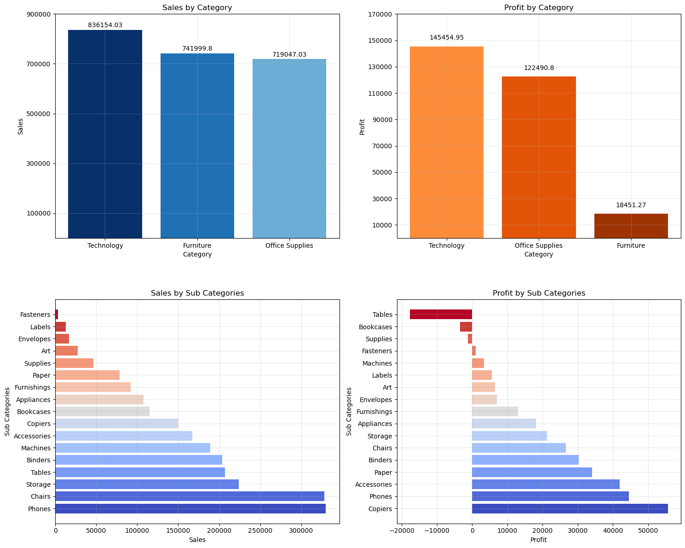

---

## 2. Sales and Profit by Sub-Category

- Sales comparison
- Profit comparison

**Objective**

Understand which product sub-categories contribute most to revenue and profitability.

   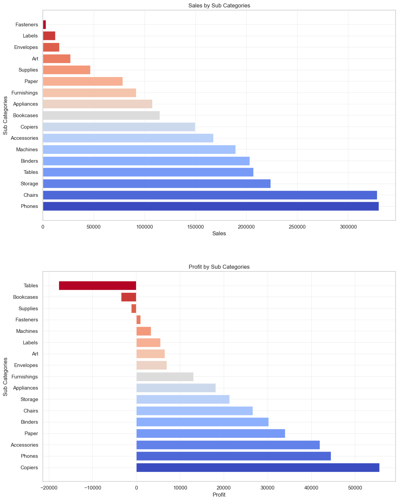

---

## 3. Top 10 and Bottom 10 Products by Sales

- Highest selling products
- Lowest selling products

**Objective**

Identify best-performing and underperforming products.

   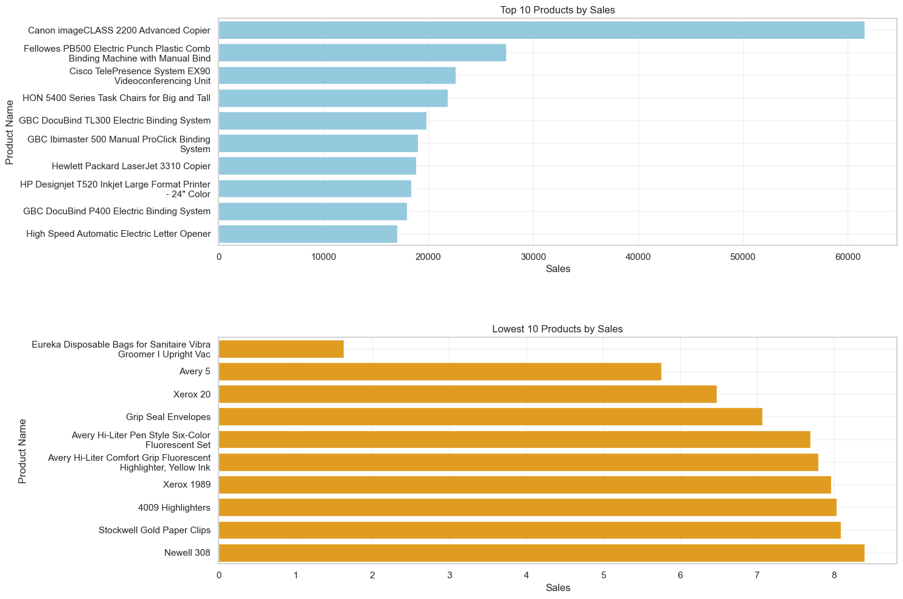

---

## 4. Regional Sales and Profit Comparison

Compare:

- East
- West
- Central
- South

**Objective**

Evaluate business performance across different regions.

   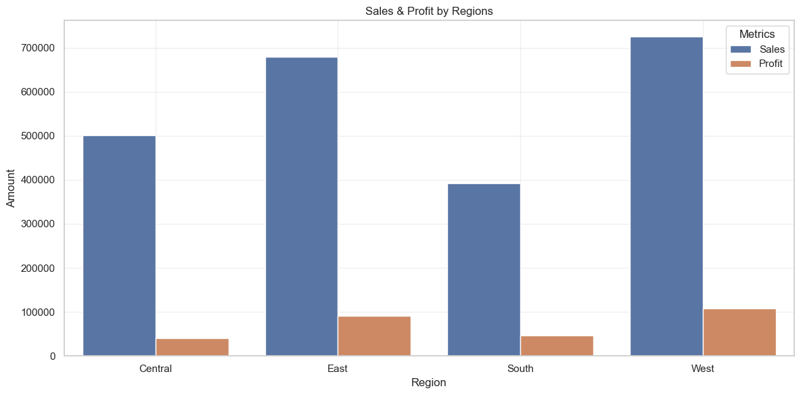

---

## 5. State-wise Performance

- Top 10 States by Sales
- Top 10 States by Profit
- Top 10 Loss-making States

**Objective**

Identify high-performing and loss-generating states.

   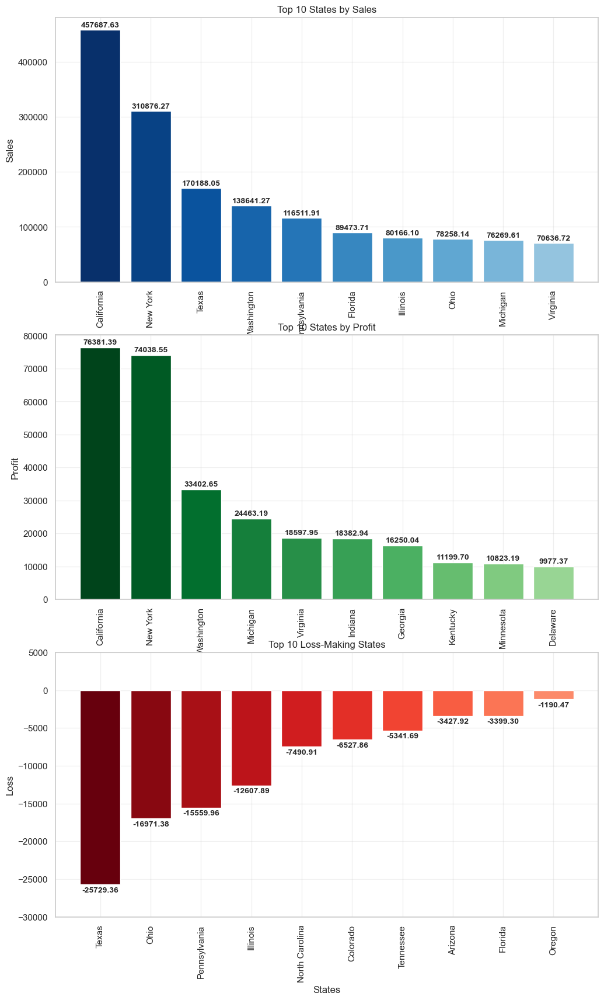

---

## 6. City-wise Performance

- Top Cities by Sales
- Top Cities by Profit
- Cities with Highest Loss

**Objective**

Analyze business performance at city level.

   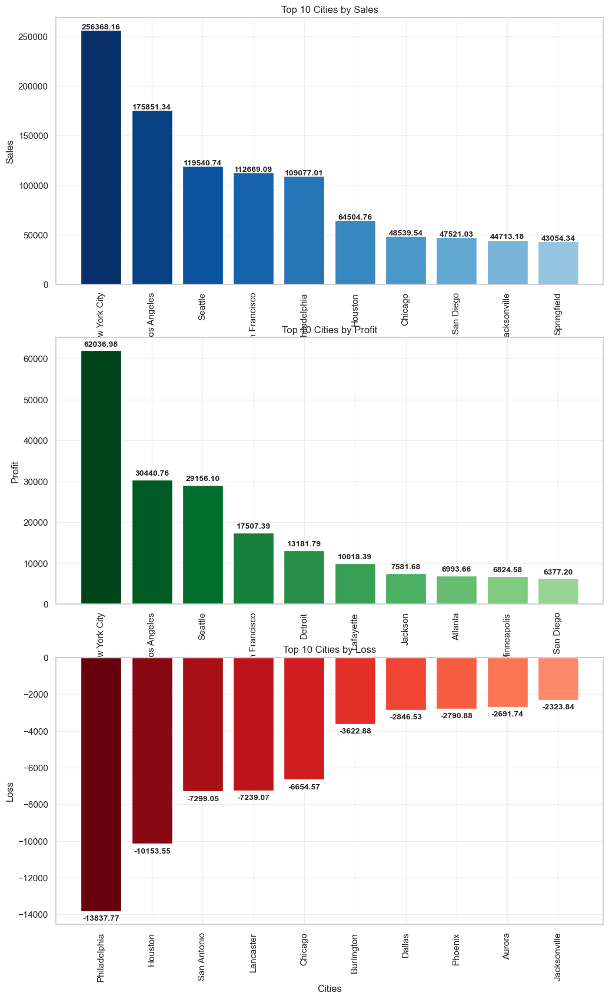

---

## 7. Customer Analysis

- Top Customers by Sales
- Top Customers by Profit
- Customers generating Loss

**Objective**

Recognize valuable customers and customers requiring business attention.

   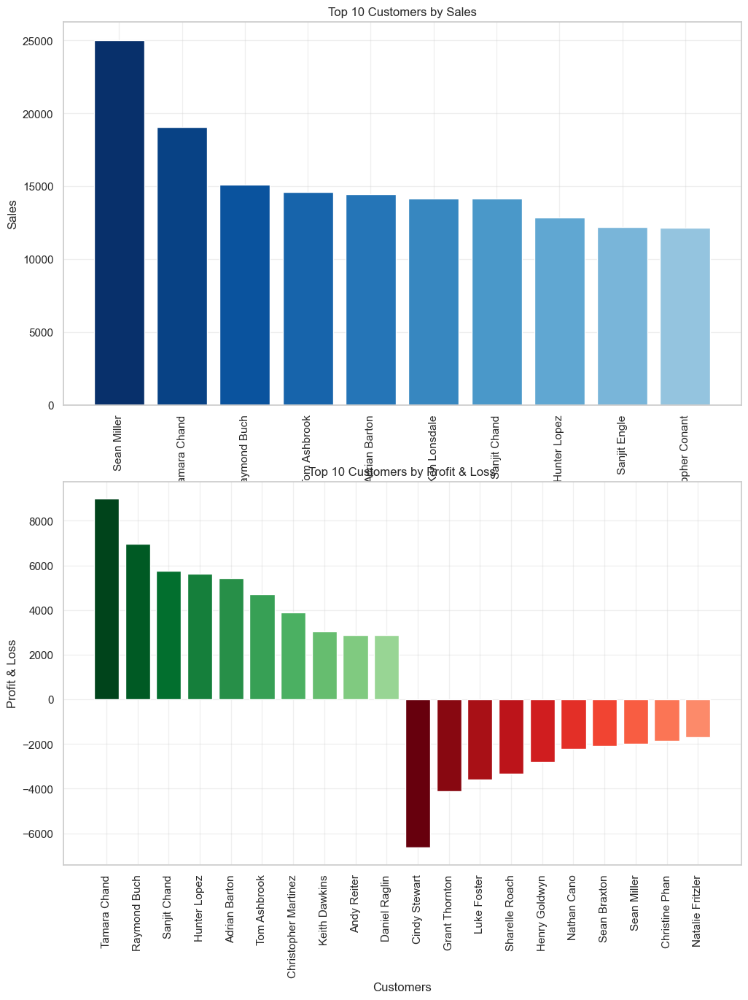

---

## 8. Product Profitability

- Most Profitable Products
- Least Profitable Products

**Objective**

Determine products that maximize or reduce profitability.

   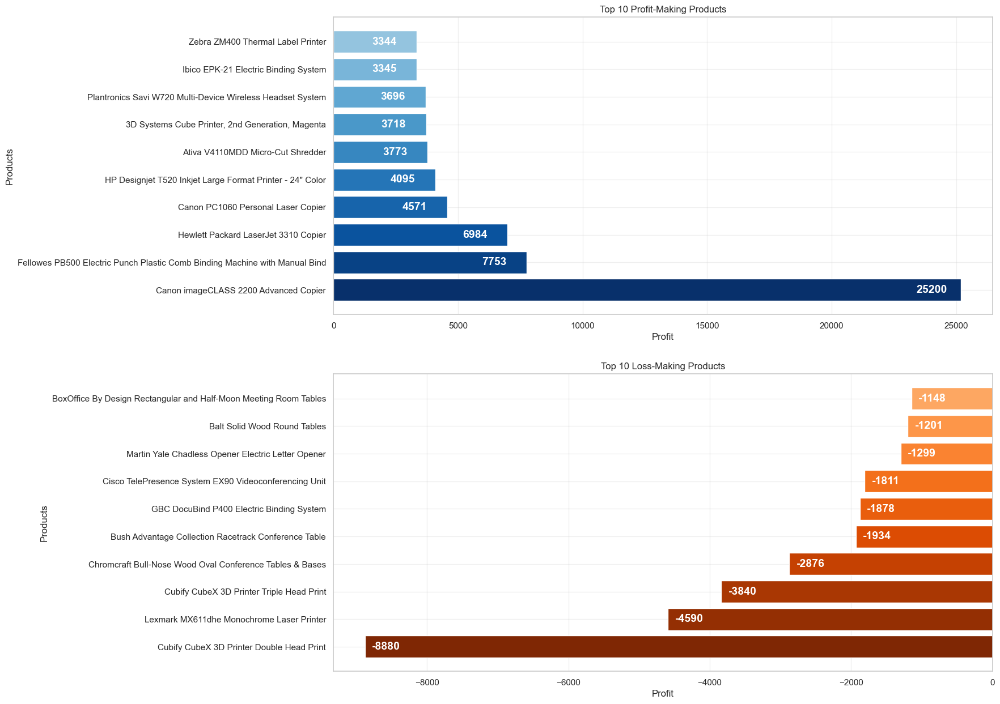

---

## 9. Customer Segment Distribution

Visualization of order distribution among:

- Consumer
- Corporate
- Home Office

**Objective**

Understand customer segmentation.

   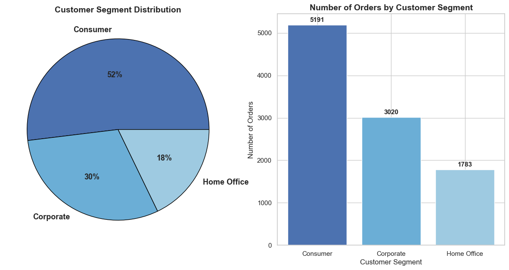

---

## 10. Shipping Mode Distribution

Order percentage by shipping mode.

**Objective**

Analyze customer shipping preferences.

   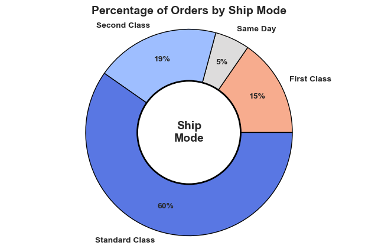

---

## 11. Monthly Sales Trend

Monthly sales across multiple years.

**Objective**

Identify seasonal trends and sales growth patterns.

   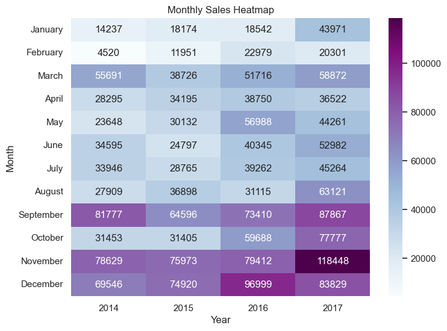

---

## 12. Discount vs Average Profit

Line chart showing the relationship between discount and average profit.

**Objective**

Understand how discounts affect profitability.

   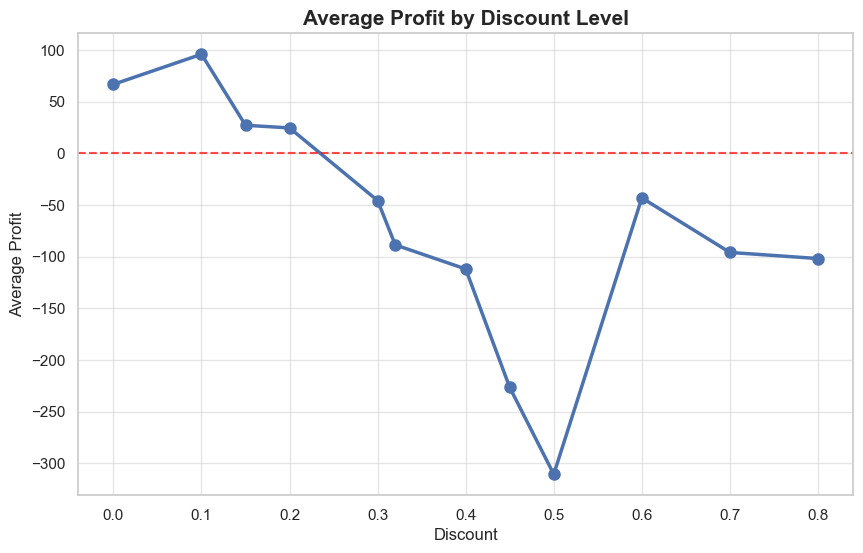

---

## 13. Monthly Order Trend

Monthly order volume over time.

**Objective**

Analyze customer purchasing patterns and business growth.

   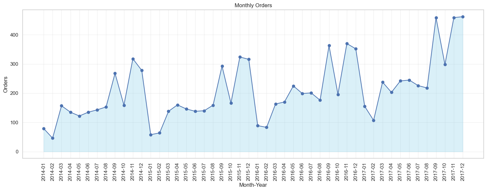

---

# Business Insights

This analysis helps answer questions such as:

- Which category generates the highest revenue?
- Which products are most profitable?
- Which states and cities perform best?
- Which customers contribute the most revenue?
- How do discounts affect profits?
- Are there seasonal sales trends?
- Which shipping methods are most preferred?

---

## Learning Outcomes

Through this project, you will learn:

- Data Cleaning
- Exploratory Data Analysis (EDA)
- Data Aggregation using Pandas
- Business Insight Generation
- Data Visualization using Matplotlib & Seaborn
- Trend Analysis
- Customer & Product Analytics

---

## Author

**Brijesh Raval**
